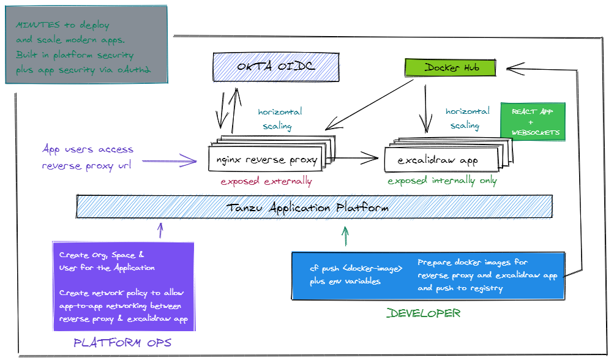

<div align="center" style="display:flex;flex-direction:column;">
  <a href="https://excalidraw.com">
    
  </a>
  <h3>Excalidraw is a whiteboard tool that lets you easily sketch diagrams with a hand-drawn feel. In this scenario, we are leveraging the simplicity of TANZU APPLICATION SERVICES platform to deploy the Excalidraw app along with an authentication workflow with OKTA as the OIDC provider</h3>
  <p>
    <a href="https://twitter.com/Excalidraw">
      
    </a>
    <a target="_blank" href="https://crowdin.com/project/excalidraw">
      
    </a>
    <a target="_blank" href="https://hub.docker.com/r/excalidraw/excalidraw">
      
    </a>
  </p>
</div>

## PRE-REQUISITES

* You have a Tanzu Application Services environment running
* You have an Org, Space and User defined to deploy applications
* You have cf CLI v7 installed on your machine as a developer of these applications
* You are logged into your Org/Space via cf-cli

## OKTA SETUP

## DEPLOY EXCALIDRAW AS AN INTERNAL ONLY OR BACKEND APP

* Navigate to excalidraw directory and open the manifest.yml file
* Edit the app name and also the apps.internal route
* Issue the command cf-push
* The application will be deployed to your platform as an "INTERNALLY ONLY" app

## DEPLOY NGINX FRONTEND

* Navigate to nginx-frontend directory
* Edit the manifest.yml
* Change the app name to reflect the redirect url and initiate login url provided in the OKTA setup
* Change the environmental variables 
* Issue the command "cf push"

## ENABLE SECURE CONTAINER-TO-CONTAINER NETWORKING b/w NGINX FRONTEND & EXCALIDRAW APP

* Tanzu Application Service is high on security
* By default container apps cannot talk to each other on internal network
* We have to deploy networking policies to enable the same
* Issue the command 
```
cf add-network-policy <nginx-app-name> <excalidraw-app-name> --protocol tcp --port 80
```
* Access the application on the NGINX app URL
